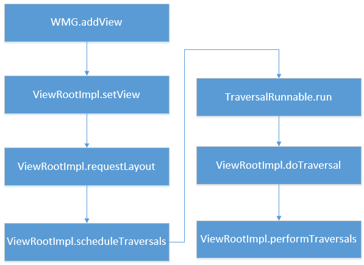
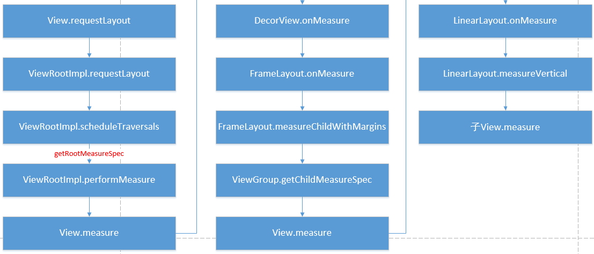
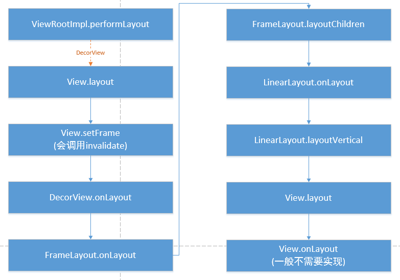

# Android自定义View
## 概述
### Android开发进阶的必经之路
### 为什么要自定义View
### 自定义View的基本方法
自定义View的最基本的三个方法分别是： onMeasure()、onLayout()、onDraw();
View在Activity中显示出来，要经历测量、布局和绘制三个步骤，分别对应三个动作：measure、layout和draw。
- 测量：onMeasure()决定View的大小；
- 布局：onLayout()决定View在ViewGroup中的位置；
- 绘制：onDraw()决定绘制这个View。
### 自定义控件分类
- 自定义View: 只需要重写onMeasure()和onDraw()
- 自定义ViewGroup: 则只需要重写onMeasure()和onLayout()

## 自定义View基础
### View的分类
视图View主要分为两类
|   类别   |  解释    |   特点   |
| ---- | ---- | ---- |
|   单一视图   |   即一个View，如TextView   |  不包含子View    |
|   视图组   |   即多个View组成的ViewGroup，如LinearLayout   |  包含子View  |

### View类简介
- View类是Android中各种组件的基类，如View是ViewGroup基类
- View表现为显示在屏幕上的各种视图
> Android中的UI组件都由View、ViewGroup组成。

- View的构造函数：共有4个

  ```java
  // 如果View是在Java代码里面new的，则调用第一个构造函数
   public CarsonView(Context context) {
          super(context);
      }
  
  // 如果View是在.xml里声明的，则调用第二个构造函数
  // 自定义属性是从AttributeSet参数传进来的
      public  CarsonView(Context context, AttributeSet attrs) {
          super(context, attrs);
      }
  
  // 不会自动调用
  // 一般是在第二个构造函数里主动调用
  // 如View有style属性时
      public  CarsonView(Context context, AttributeSet attrs, int defStyleAttr) {
          super(context, attrs, defStyleAttr);
      }
  
      //API21之后才使用
      // 不会自动调用
      // 一般是在第二个构造函数里主动调用
      // 如View有style属性时
      public  CarsonView(Context context, AttributeSet attrs, int defStyleAttr, int defStyleRes) {
          super(context, attrs, defStyleAttr, defStyleRes);
      }
  ```
  
### AttributeSet与自定义属性
　系统自带的View可以在xml中配置属性，对于写的好的自定义View同样可以在xml中配置属性，为了使自定义的View的属性可以在xml中配置，需要以下4个步骤：
1. 通过```<declare-styleable>```为自定义View添加属性
2. 在xml中为相应的属性声明属性值
3. 在运行时（一般为构造函数）获取属性值
4. 将获取到的属性值应用到View

### View视图结构
1. PhoneWindow是Android系统中最基本的窗口系统，继承自Windows类，负责管理界面显示以及事件响应。它是Activity与View系统交互的接口
2. DecorView是PhoneWindow中的起始节点View，继承于View类，作为整个视图容器来使用。用于设置窗口属性。它本质上是一个FrameLayout
3. ViewRoot在Activtiy启动时创建，负责管理、布局、渲染窗口UI等等


对于多View的视图，结构是树形结构：最顶层是ViewGroup，ViewGroup下可能有多个ViewGroup或View，如下图：


一定要记住：无论是measure过程、layout过程还是draw过程，永远都是从View树的根节点开始测量或计算（即从树的顶端开始），一层一层、一个分支一个分支地进行（即树形递归），最终计算整个View树中各个View，最终确定整个View树的相关属性。
### Android坐标系
Android的坐标系定义为：
- 屏幕的左上角为坐标原点
- 向右为x轴增大方向
- 向下为y轴增大方向


> 区别于一般的数学坐标系


###  View位置（坐标）描述
View的位置由4个顶点决定的
4个顶点的位置描述分别由4个值决定：
> 请记住：View的位置是相对于父控件而言的）

- Top：子View上边界到父view上边界的距离
- Left：子View左边界到父view左边界的距离
- Bottom：子View下边距到父View上边界的距离
- Right：子View右边界到父view左边界的距离

### 位置获取方式
View的位置是通过view.getxxx()函数进行获取：（以Top为例）
```java
// 获取Top位置
public final int getTop() {  
    return mTop;  
}  

// 其余如下：
  getLeft();      //获取子View左上角距父View左侧的距离
  getBottom();    //获取子View右下角距父View顶部的距离
  getRight();     //获取子View右下角距父View左侧的距离
```

与MotionEvent中 get()和getRaw()的区别
```java
//get() ：触摸点相对于其所在组件坐标系的坐标
 event.getX();       
 event.getY();

//getRaw() ：触摸点相对于屏幕默认坐标系的坐标
 event.getRawX();    
 event.getRawY();
```

### Android中颜色相关内容
Android支持的颜色模式：

以ARGB8888为例介绍颜色定义:


## View树的绘制流程

### View树的绘制流程是谁负责的？

view树的绘制流程是通过ViewRoot去负责绘制的，ViewRoot这个类的命名有点坑，最初看到这个名字，翻译过来是view的根节点，但是事实完全不是这样，ViewRoot其实不是View的根节点，它连view节点都算不上，它的主要作用是View树的管理者，负责将DecorView和PhoneWindow“组合”起来，而View树的根节点严格意义上来说只有DecorView；每个DecorView都有一个ViewRoot与之关联，这种关联关系是由WindowManager去进行管理的；

### view的添加



### view的绘制流程


### measure
1. 系统为什么要有measure过程？
2. measure过程都干了点什么事？
3. 对于自适应的尺寸机制，如何合理的测量一颗View树？
4. 那么ViewGroup是如何向子View传递限制信息的？············
5. ScrollView嵌套ListView问题？



### onMeasure()方法中常用的方法
1. getChildCount()：获取子View的数量；
2. getChildAt(i)：获取第i个子控件；
3.  subView.getLayoutParams().width/height：设置或获取子控件的宽或高；
4. measureChild(child, widthMeasureSpec, heightMeasureSpec)：测量子View的宽高；
5. child.getMeasuredHeight/width()：执行完measureChild()方法后就可以通过这种方式获取子View的宽高值；
6. getPaddingLeft/Right/Top/Bottom()：获取控件的四周内边距；
7. setMeasuredDimension(width, height)：重新设置控件的宽高

### layout
1. 系统为什么要有layout过程？
2. layout过程都干了点什么事？



### draw
1. 系统为什么要有draw过程？
2. draw过程都干了点什么事？


## LayoutParams

ayoutParams翻译过来就是布局参数，子View通过LayoutParams告诉父容器（ViewGroup）应该如何放置自己。从这个定义中也可以看出来LayoutParams与ViewGroup是息息相关的，因此脱离ViewGroup谈LayoutParams是没有意义的。

事实上，每个ViewGroup的子类都有自己对应的LayoutParams类，典型的如LinearLayout.LayoutParams和FrameLayout.LayoutParams等，可以看出来LayoutParams都是对应ViewGroup子类的内部类

### MarginLayoutParams

MarginLayoutParams是和外间距有关的。事实也确实如此，和LayoutParams相比，MarginLayoutParams只是增加了对上下左右外间距的支持。实际上大部分LayoutParams的实现类都是继承自MarginLayoutParams，因为基本所有的父容器都是支持子View设置外间距的

- 属性优先级问题
  MarginLayoutParams主要就是增加了上下左右4种外间距。在构造方法中，先是获取了margin属性；如果该值不合法，就获取horizontalMargin；如果该值不合法，再去获取leftMargin和rightMargin属性（verticalMargin、topMargin和bottomMargin同理）。我们可以据此总结出这几种属性的优先级

> margin > horizontalMargin和verticalMargin > leftMargin和RightMargin、topMargin和bottomMargin

- 属性覆盖问题
  优先级更高的属性会覆盖掉优先级较低的属性。此外，还要注意一下这几种属性上的注释

> Call {@link ViewGroup#setLayoutParams(LayoutParams)} after reassigning a new value

### LayoutParams与View如何建立联系

- 在XML中定义View
- 在Java代码中直接生成View对应的实例对象

### addView

```java
/**
 * 重载方法1：添加一个子View
 * 如果这个子View还没有LayoutParams，就为子View设置当前ViewGroup默认的LayoutParams
 */
public void addView(View child) {
    addView(child, -1);
}

/**
 * 重载方法2：在指定位置添加一个子View
 * 如果这个子View还没有LayoutParams，就为子View设置当前ViewGroup默认的LayoutParams
 * @param index View将在ViewGroup中被添加的位置（-1代表添加到末尾）
 */
public void addView(View child, int index) {
    if (child == null) {
        throw new IllegalArgumentException("Cannot add a null child view to a ViewGroup");
    }
    LayoutParams params = child.getLayoutParams();
    if (params == null) {
        params = generateDefaultLayoutParams();// 生成当前ViewGroup默认的LayoutParams
        if (params == null) {
            throw new IllegalArgumentException("generateDefaultLayoutParams() cannot return null");
        }
    }
    addView(child, index, params);
}

/**
 * 重载方法3：添加一个子View
 * 使用当前ViewGroup默认的LayoutParams，并以传入参数作为LayoutParams的width和height
 */
public void addView(View child, int width, int height) {
    final LayoutParams params = generateDefaultLayoutParams();  // 生成当前ViewGroup默认的LayoutParams
    params.width = width;
    params.height = height;
    addView(child, -1, params);
}

/**
 * 重载方法4：添加一个子View，并使用传入的LayoutParams
 */
@Override
public void addView(View child, LayoutParams params) {
    addView(child, -1, params);
}

/**
 * 重载方法4：在指定位置添加一个子View，并使用传入的LayoutParams
 */
public void addView(View child, int index, LayoutParams params) {
    if (child == null) {
        throw new IllegalArgumentException("Cannot add a null child view to a ViewGroup");
    }

    // addViewInner() will call child.requestLayout() when setting the new LayoutParams
    // therefore, we call requestLayout() on ourselves before, so that the child's request
    // will be blocked at our level
    requestLayout();
    invalidate(true);
    addViewInner(child, index, params, false);
}

private void addViewInner(View child, int index, LayoutParams params,
        boolean preventRequestLayout) {
    .....
    if (mTransition != null) {
        mTransition.addChild(this, child);
    }

    if (!checkLayoutParams(params)) { // ① 检查传入的LayoutParams是否合法
        params = generateLayoutParams(params); // 如果传入的LayoutParams不合法，将进行转化操作
    }

    if (preventRequestLayout) { // ② 是否需要阻止重新执行布局流程
        child.mLayoutParams = params; // 这不会引起子View重新布局（onMeasure->onLayout->onDraw）
    } else {
        child.setLayoutParams(params); // 这会引起子View重新布局（onMeasure->onLayout->onDraw）
    }

    if (index < 0) {
        index = mChildrenCount;
    }

    addInArray(child, index);

    // tell our children
    if (preventRequestLayout) {
        child.assignParent(this);
    } else {
        child.mParent = this;
    }
    .....
}

```

### 自定义LayoutParams

1. 创建自定义属性

```java
<resources>
    <declare-styleable name="xxxViewGroup_Layout">
        <!-- 自定义的属性 -->
        <attr name="layout_simple_attr" format="integer"/>
        <!-- 使用系统预置的属性 -->
        <attr name="android:layout_gravity"/>
    </declare-styleable>
</resources>
```

2. 继承MarginLayout

```java
public static class LayoutParams extends ViewGroup.MarginLayoutParams {
    public int simpleAttr;
    public int gravity;

    public LayoutParams(Context c, AttributeSet attrs) {
        super(c, attrs);
        // 解析布局属性
        TypedArray typedArray = c.obtainStyledAttributes(attrs, R.styleable.SimpleViewGroup_Layout);
        simpleAttr = typedArray.getInteger(R.styleable.SimpleViewGroup_Layout_layout_simple_attr, 0);
        gravity=typedArray.getInteger(R.styleable.SimpleViewGroup_Layout_android_layout_gravity, -1);

        typedArray.recycle();//释放资源
    }

    public LayoutParams(int width, int height) {
        super(width, height);
    }

    public LayoutParams(MarginLayoutParams source) {
        super(source);
    }

    public LayoutParams(ViewGroup.LayoutParams source) {
        super(source);
    }
}
```

3. 重写ViewGroup中几个与LayoutParams相关的方法

```java
// 检查LayoutParams是否合法
@Override
protected boolean checkLayoutParams(ViewGroup.LayoutParams p) { 
    return p instanceof SimpleViewGroup.LayoutParams;
}

// 生成默认的LayoutParams
@Override
protected ViewGroup.LayoutParams generateDefaultLayoutParams() { 
    return new SimpleViewGroup.LayoutParams(LayoutParams.MATCH_PARENT, LayoutParams.WRAP_CONTENT);
}

// 对传入的LayoutParams进行转化
@Override
protected ViewGroup.LayoutParams generateLayoutParams(ViewGroup.LayoutParams p) { 
    return new SimpleViewGroup.LayoutParams(p);
}

// 对传入的LayoutParams进行转化
@Override
public ViewGroup.LayoutParams generateLayoutParams(AttributeSet attrs) { 
    return new SimpleViewGroup.LayoutParams(getContext(), attrs);
}
```

### LayoutParams常见的子类

在为View设置LayoutParams的时候需要根据它的父容器选择对应的LayoutParams，否则结果可能与预期不一致，这里简单罗列一些常见的LayoutParams子类：

- ViewGroup.MarginLayoutParams
- FrameLayout.LayoutParams
- LinearLayout.LayoutParams
- RelativeLayout.LayoutParams
- RecyclerView.LayoutParams
- GridLayoutManager.LayoutParams
- StaggeredGridLayoutManager.LayoutParams
- ViewPager.LayoutParams
- WindowManager.LayoutParams

## MeasureSpec

### 定义


测量规格,封装了父容器对 view 的布局上的限制，内部提供了宽高的信息（ SpecMode 、 SpecSize ），SpecSize是指在某种SpecMode下的参考尺寸，其中SpecMode 有如下三种：

- UNSPECIFIED
  父控件不对你有任何限制，你想要多大给你多大，想上天就上天。这种情况一般用于系统内部，表示一种测量状态。（这个模式主要用于系统内部多次Measure的情形，并不是真的说你想要多大最后就真有多大）
- EXACTLY
  父控件已经知道你所需的精确大小，你的最终大小应该就是这么大。
- AT_MOST
  你的大小不能大于父控件给你指定的size，但具体是多少，得看你自己的实现。
  

### MeasureSpecs 的意义

通过将 SpecMode 和 SpecSize 打包成一个 int 值可以避免过多的对象内存分配，为了方便操作，其提供了打包 / 解包方法

### MeasureSpec值的确定

MeasureSpec值到底是如何计算得来的呢?

子View的MeasureSpec值是根据子View的布局参数（LayoutParams）和父容器的MeasureSpec值计算得来的，具体计算逻辑封装在getChildMeasureSpec()里

```java
  /**
     *
     * 目标是将父控件的测量规格和child view的布局参数LayoutParams相结合，得到一个
     * 最可能符合条件的child view的测量规格。  

     * @param spec 父控件的测量规格
     * @param padding 父控件里已经占用的大小
     * @param childDimension child view布局LayoutParams里的尺寸
     * @return child view 的测量规格
     */
    public static int getChildMeasureSpec(int spec, int padding, int childDimension) {
        int specMode = MeasureSpec.getMode(spec); //父控件的测量模式
        int specSize = MeasureSpec.getSize(spec); //父控件的测量大小

        int size = Math.max(0, specSize - padding);

        int resultSize = 0;
        int resultMode = 0;

        switch (specMode) {
        // 当父控件的测量模式 是 精确模式，也就是有精确的尺寸了
        case MeasureSpec.EXACTLY:
            //如果child的布局参数有固定值，比如"layout_width" = "100dp"
            //那么显然child的测量规格也可以确定下来了，测量大小就是100dp，测量模式也是EXACTLY
            if (childDimension >= 0) {
                resultSize = childDimension;
                resultMode = MeasureSpec.EXACTLY;
            } 

            //如果child的布局参数是"match_parent"，也就是想要占满父控件
            //而此时父控件是精确模式，也就是能确定自己的尺寸了，那child也能确定自己大小了
            else if (childDimension == LayoutParams.MATCH_PARENT) {
                resultSize = size;
                resultMode = MeasureSpec.EXACTLY;
            }
            //如果child的布局参数是"wrap_content"，也就是想要根据自己的逻辑决定自己大小，
            //比如TextView根据设置的字符串大小来决定自己的大小
            //那就自己决定呗，不过你的大小肯定不能大于父控件的大小嘛
            //所以测量模式就是AT_MOST，测量大小就是父控件的size
            else if (childDimension == LayoutParams.WRAP_CONTENT) {
                resultSize = size;
                resultMode = MeasureSpec.AT_MOST;
            }
            break;

        // 当父控件的测量模式 是 最大模式，也就是说父控件自己还不知道自己的尺寸，但是大小不能超过size
        case MeasureSpec.AT_MOST:
            //同样的，既然child能确定自己大小，尽管父控件自己还不知道自己大小，也优先满足孩子的需求
            if (childDimension >= 0) {
                resultSize = childDimension;
                resultMode = MeasureSpec.EXACTLY;
            } 
            //child想要和父控件一样大，但父控件自己也不确定自己大小，所以child也无法确定自己大小
            //但同样的，child的尺寸上限也是父控件的尺寸上限size
            else if (childDimension == LayoutParams.MATCH_PARENT) {
                resultSize = size;
                resultMode = MeasureSpec.AT_MOST;
            }
            //child想要根据自己逻辑决定大小，那就自己决定呗
            else if (childDimension == LayoutParams.WRAP_CONTENT) {
                resultSize = size;
                resultMode = MeasureSpec.AT_MOST;
            }
            break;

        // Parent asked to see how big we want to be
        case MeasureSpec.UNSPECIFIED:
            if (childDimension >= 0) {
                // Child wants a specific size... let him have it
                resultSize = childDimension;
                resultMode = MeasureSpec.EXACTLY;
            } else if (childDimension == LayoutParams.MATCH_PARENT) {
                // Child wants to be our size... find out how big it should
                // be
                resultSize = 0;
                resultMode = MeasureSpec.UNSPECIFIED;
            } else if (childDimension == LayoutParams.WRAP_CONTENT) {
                // Child wants to determine its own size.... find out how
                // big it should be
                resultSize = 0;
                resultMode = MeasureSpec.UNSPECIFIED;
            }
            break;
        }
        return MeasureSpec.makeMeasureSpec(resultSize, resultMode);
    }
```


针对上表，这里再做一下具体的说明

- 对于应用层 View ，其 MeasureSpec 由父容器的 MeasureSpec 和自身的 LayoutParams 来共同决定
- 对于不同的父容器和view本身不同的LayoutParams，view就可以有多种MeasureSpec。
      1.  当view采用固定宽高的时候，不管父容器的MeasureSpec是什么，view的MeasureSpec都是精确模式并且其大小遵循Layoutparams中的大小；
      2. 当view的宽高是match_parent时，这个时候如果父容器的模式是精准模式，那么view也是精准模式并且其大小是父容器的剩余空间，如果父容器是最大模式，那么view也是最大模式并且其大小不会超过父容器的剩余空间；
      3.  当view的宽高是wrap_content时，不管父容器的模式是精准还是最大化，view的模式总是最大化并且大小不能超过父容器的剩余空间。
      4. Unspecified模式，这个模式主要用于系统内部多次measure的情况下，一般来说，我们不需要关注此模式(这里注意自定义View放到ScrollView的情况 需要处理)。